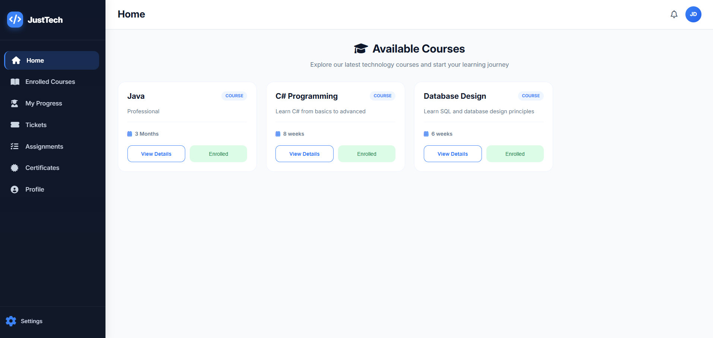
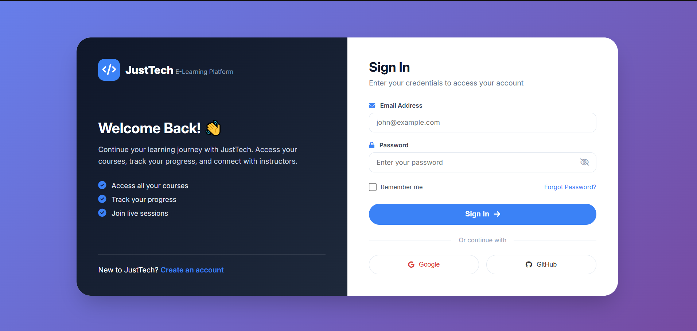
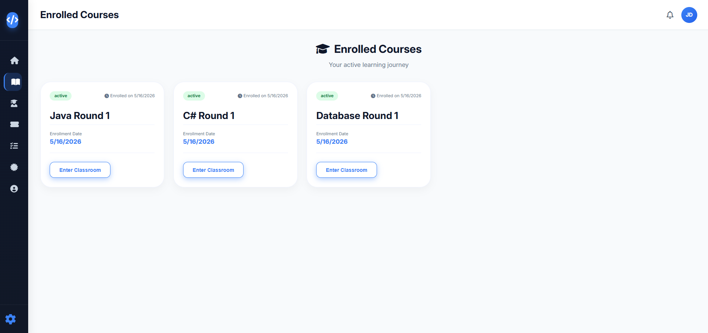
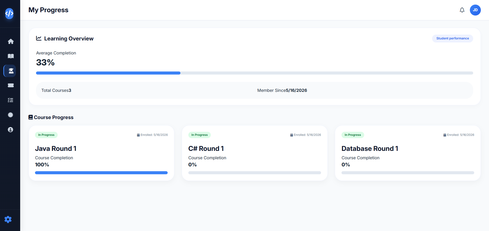
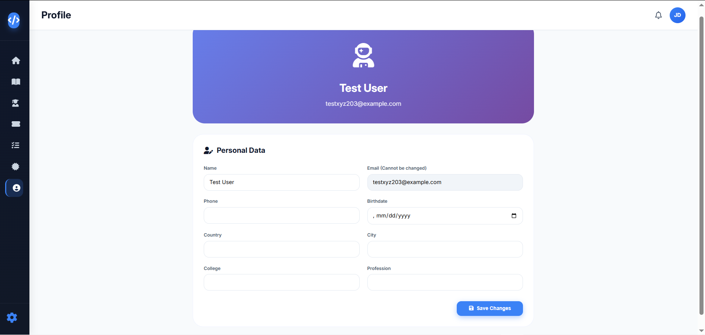
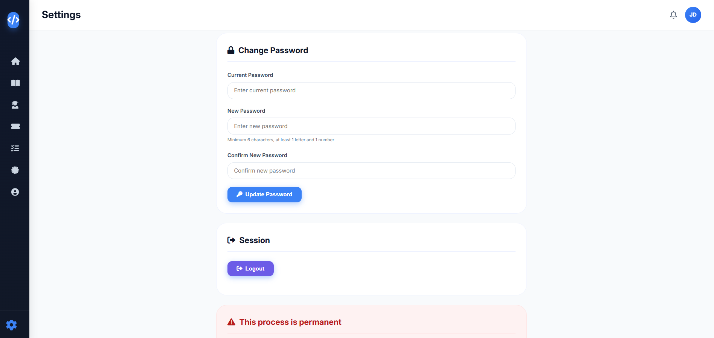
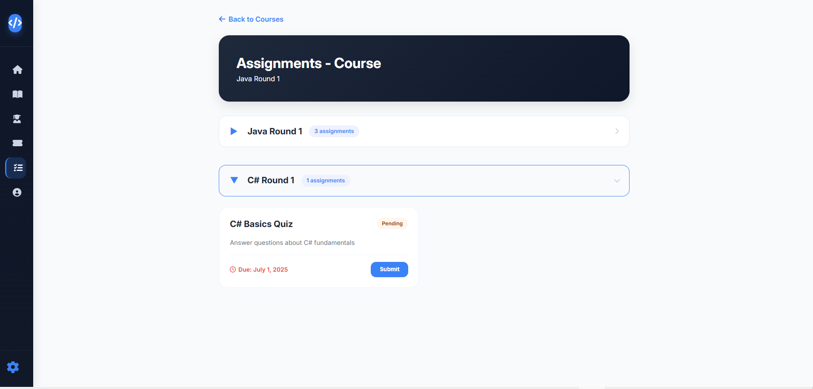

# JustTech

> E-Learning Platform for Educational Institutions

---

## 📖 Project Idea

**JustTech** is an **E-Learning Website** designed to help educational institutions organize and track their education system efficiently.

### Key Objectives:
- Provide a centralized platform for online learning
- Organize courses, students, and progress tracking
- Streamline educational management for institutions

### Target Audience:
- Educational institutions (schools, academies, training centers)

---

## 👥 Team Members (pentaRae)

| Name | Role |
|------|------|
| Abdullah Khaled Abou Eissa | Backend Developer |
| Mohamed Adel | Database Administrator |
| Mira | Backend Developer |
| Nardeen | Frontend Developer |
| Mohamed Sameh | Documentation & Presentation Lead |

---

## 📅 Work Plan

| Phase | Task |
|-------|------|
| **1** | Research & Analysis |
| **2** | Visual Identity |
| **3** | Main Designs |
| **4** | Complementary Products |
| **5** | Review & Finalization |
| **6** | Final Presentation |

### Phase Details

#### 1. Research & Analysis

### Audience Personas

| Persona | Description | Goals |
|---------|-------------|-------|
| **Student** | Individual who wants to learn new skills online | Enroll in courses, watch lectures, track progress, earn certificates |
| **Instructor** | Subject matter expert who creates and manages courses | Create courses, upload lectures, create assignments, grade submissions |


#### 2. Main Designs









#### 4. Complementary Products

| Product | Description | Status |
|---------|-------------|--------|
| **Mobile Responsive Design** | Frontend adapts to all screen sizes | ✅ Completed |
| **JWT Authentication** | Secure login with token-based auth | ✅ Completed |
| **Certificate Generation** | Auto-generated PDF certificates at 100% progress | ✅ Completed |
| **Email Notifications** | (Future enhancement) | ⏳ Planned |
| **Payment Integration** | (Future enhancement) | ⏳ Planned |
| **Mobile App** | (Future enhancement) | ⏳ Planned |

#### 5. Review & Finalization

| Task | Status |
|------|--------|
| Code review by team members | ✅ Completed |
| Bug fixes and performance optimization | ✅ Completed |
| CORS configuration for GitHub Pages | ✅ Completed |
| Testing on live environment | ✅ Completed |
| README documentation finalization | ✅ Completed |
| Deployment to MonsterASP.net | ✅ Completed |
| Frontend deployment to GitHub Pages | ✅ Completed |

#### 6. Final Presentation
*Presentation Link:** [https://docs.google.com/presentation/d/1qozLoMd1o1Na5J3vqnh6K11PikIyVuuzA_mri2abm1g/edit?usp=sharing]

---

##  Instructor

**Ashraf Sadek**

---

## 📊 KPIs (Key Performance Indicators)

- **Response Time:** API responds within 500ms ✅
- **System Uptime:** 99% availability ✅
- **User Adoption:** Target 50+ users (in progress)
- **Course Completion:** Target 70% completion rate (in progress)


---

## 🌐 Live Demo

| Environment | URL |
|-------------|-----|
| Backend API | http://justtech.runasp.net |
| API Docs | http://justtech.runasp.net/swagger |
| Frontend | https://abdullah-khaled-aboueissa.github.io/JustTech-Frontend/ |

**Test Credentials:**
- Email: testxyz203@example.com
- Password: 123456

---

## 📊 API Endpoints Summary

| Feature | Method | Endpoint |
|---------|--------|----------|
| Register | POST | `/api/auth/register` |
| Login | POST | `/api/auth/login` |
| Get Courses | GET | `/api/courses` |
| Enroll | POST | `/api/enrollments` |
| Get Lectures | GET | `/api/lectures/round/{roundId}` |
| Submit Assignment | POST | `/api/submissions` |
| Get Certificate | GET | `/api/certificates/student/{studentId}` |

Full documentation available at `/swagger`


---


## ✅ Features Implemented

### Completed
- ✅ User Authentication (Register, Login, Change Password)
- ✅ Course Browsing & Enrollment
- ✅ Lecture Watching with YouTube Integration
- ✅ Progress Tracking (Lecture Completion)
- ✅ Assignment Submission (Rich Text + URL)
- ✅ Certificate Generation at 100% Progress
- ✅ My Progress Dashboard
- ✅ Responsive Sidebar with Hover Effect
- ✅ CORS Configuration for GitHub Pages


### Planned
- ⏳ Instructor Panel
- ⏳ Grading System
- ⏳ Course Rating & Reviews
- ⏳ Email Notifications
---

## 🧪 How to Test the Application

1. **Register** a new student account
2. **Login** with your credentials
3. **Browse** available courses on the Home page
4. **Enroll** in a course
5. **Watch** lectures and click "Mark as Completed"
6. **Track** your progress in "My Progress" page
7. **Submit** assignments when available
8. **Earn** certificate when progress reaches 100%

---

## 🛠️ Tech Stack

### Backend
- **Framework**: ASP.NET Core Web API (.NET 10)
- **Architecture**: Clean Architecture (Core, Business, Infrastructure)
- **Authentication**: JWT (JSON Web Tokens)
- **Database**: SQL Server (planned)
- **ORM**: Entity Framework Core (planned)

### Frontend
- **Technologies**: HTML5, CSS3, JavaScript 
- **Responsive Design**: Yes

### Tools & Version Control
- **Version Control**: Git & GitHub
- **API Testing**: Swagger/Postman

---

## 📂 Repository Structure

```
DEPI-GP/
├── Backend/
│   └── JustTech/
│       ├── JustTech.Core/           # Entities & Interfaces
│       ├── Business Logic/          # Services & DTOs
│       ├── JustTech.Infrastructure/ # Repositories
│       └── JustTech/                # API Controllers
├── Frontend/
│   ├── index.html
│   ├── login.html
│   ├── signup.html
│   ├── assignments.html
│   ├── certificates.html
│   ├── course-content.html
│   ├── my-enrollments.html
│   ├── view-certificate.html
│   ├── style.css
│   ├── auth.css
│   └── script.js
└── README.md
```

---

## 🚀 How to Run the Project

### Backend (API)
1. Open solution in Visual Studio 2022+
2. Set `JustTech` as startup project
3. Run `dotnet restore`
4. Run `dotnet run` or press F5

### Frontend
1. Open `Frontend/index.html` in any browser
2. Or use Live Server extension in VS Code

---

## 🔒 Branch Protection Rules (Recommended)

To prevent accidental data loss (like force pushes), the repository owner should enable:
- Block force pushes on `main` branch
- Require pull requests before merging
- Include administrators in all rules
